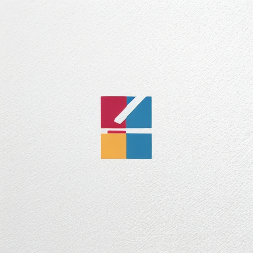

## Education

### KAIST
- B.S. in Computer Science
- Mar 2017 - Feb 2024

## Work Experience

### Pebblous
- Intern, Research Team
- May 2022 - Feb 2023

## Channel

    <ul class="author__urls social-icons">
        <li itemprop="homeLocation" itemscope="" itemtype="https://schema.org/Place">
          <i class="fas fa-fw fa-map-marker-alt" aria-hidden="true"></i>   Seoul, Korea
        </li>
        <li>
          <a href="https://github.com/jwlee3746" itemprop="sameAs" rel="nofollow noopener noreferrer">
            <i class="fab fa-fw fa-github" aria-hidden="true"></i>  https://github.com/jwlee3746
          </a>
        </li>
        <li>
          <a href="mailto:jwlee3746@naver.com">
            <meta itemprop="email" content="jwlee3746@naver.com">
            <i class="fas fa-fw fa-envelope-square" aria-hidden="true"></i>  jwlee3746@naver.com
          </a>
        </li>
        <li>
          <a href="https://www.linkedin.com/in/jwlee3746" itemprop="sameAs" rel="nofollow noopener noreferrer">
            <i class="fab fa-fw fa-instagram" aria-hidden="true"></i>  https://www.linkedin.com/in/jwlee3746
          </a>
        </li>
    </ul>
  
