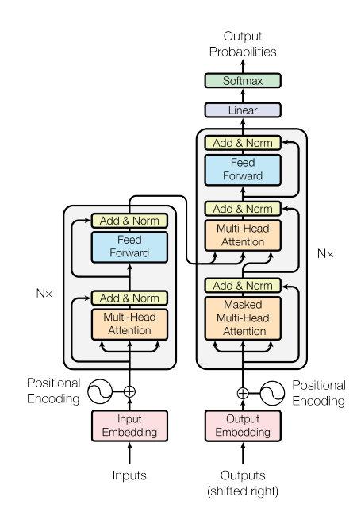

## Abstract
이 논문은 기계 번역 및 자연어 처리 분야에서 새로운 neural network 아키텍처인 "**Transformer**"를 제안한다. 기존의 순환 신경망(RNN) 또는 컨볼루션 신경망(CNN)과 달리 Transformer는 전적으로 **어텐션 메커니즘**에 기반한다.

주요 내용:

- 기존 모델은 복잡한 RNN 또는 CNN 기반 인코더-디코더 구조를 사용했지만, Transformer는 **어텐션 메커니즘**만으로 구성된다.

- Transformer는 **병렬화**가 가능하고 학습 시간도 크게 단축할 수 있다.

- 실험 결과, Transformer 모델이 WMT 2014 영어-독일어, 영어-프랑스어 번역 테스크에서 기존 최고 모델보다 높은 BLEU 점수를 기록했다.


## Background
이 부분은 Transformer 모델이 기존 sequence-to-sequence 모델들과 다른 점을 설명하고 있다:

| 특성 | 기존 모델| Transformer |
|---|---|---|
| 기본 구조 | Convolutional Neural Networks (CNNs)| Self-attention  |
| 연산 병렬화     | CNN 기반| Self-attention 기반|
| 멀리 떨어진 위치 간의 의존성 학습 | 어려움 (거리의 증가에 따라 연산량 증가)   | Multi-Head Attention으로 해결 |
| 장점 | N/A  | 위치 간 의존성을 효율적으로 계산하여 한계 극복 |
| 단점   | N/A  | 위치 가중치 평균화로 인한 해상도 감소 문제 발생  |

## Model Architecture
대부분의 최신 시퀀스 변환 모델은 인코더-디코더 구조를 따른다. 인코더는 입력 시퀀스 $\(x1,...,xn)\$ 를 연속된 표현 $\ z = (z1,...,zn) \$들로 매핑하고, 디코더는 이를 바탕으로 출력 시퀀스 $\(y1,...,ym)\$ 를 생성한다.

Auto-regressive (자기 회귀 모형): Time t 시계열(시퀀스)을 예측할 때 predictor로 t-1 데이터를 활용하는 모델. 디코더는 이전에 생성된 출력 심볼들을 추가 입력으로 사용하여 다음 심볼을 생성한다.
<div align="center">
$$ y_t = c + \sum_{i=1}^{p} \phi_i y_{t-i} + \epsilon_t $$
</div>

트랜스포머도 위 과정을 stacked self-attention과 point-wise & fully connected layer를 사용하여 해결한다.

### Encoder and Decoder Stacks

<!--  -->

#### 인코더

<div style="display: flex; justify-content: space-around;">
    
    
</div>

- 각 인코더는 2개의 레이어(muti-head self attention, fully-connected feed-forward)로 이루어짐
- 각 서브 레이어에 잔차 연결과 레이어 정규화가 있음: stack 구조로 인한 그래디언트 소실 방지
- 모든 서브 레이어의 출력 차원은 d_model(default=512) 값으로 고정

```python
class Encoder(nn.Module):
    def __init__(self, num_layers, d_model, num_heads, d_ff, input_vocab_size, max_len, dropout=0.1):
        super(Encoder, self).__init__()
        self.d_model = d_model
        self.embedding = nn.Embedding(input_vocab_size, d_model)
        self.pos_encoding = PositionalEncoding(d_model, dropout, max_len)
        self.layers = nn.ModuleList([EncoderLayer(d_model, num_heads, d_ff, dropout) for _ in range(num_layers)])

    def forward(self, src, src_mask):
        x = self.embedding(src) * torch.sqrt(torch.tensor(self.d_model).float())
        x = self.pos_encoding(x)
        for layer in self.layers:
            x = layer(x, src_mask)
        return x

class EncoderLayer(nn.Module):
    def __init__(self, d_model, num_heads, d_ff, dropout=0.1):
        super(EncoderLayer, self).__init__()
        self.multihead_attention = MultiHeadAttention(d_model, num_heads)
        self.positionwise_feedforward = PositionwiseFeedforward(d_model, d_ff)
        self.dropout = nn.Dropout(dropout)
        self.layer_norm1 = nn.LayerNorm(d_model)
        self.layer_norm2 = nn.LayerNorm(d_model)

    def forward(self, src, src_mask):
        x = src
        # Multi-Head Attention
        x = self.layer_norm1(x + self._sa_block(x, src_mask, src_key_padding_mask, is_causal=is_causal)) # (query, key, value)
        # Positionwise Feedforward
        x = self.layer_norm2(x + self._ff_block(x))
        return x
```

#### 디코더

<div style="display: flex; justify-content: space-around;">
    
</div>

- 각 디코더는 3개의 레이어(Maksed muti-head self attention, Encoder-Decoder attention, fully-connected feed-forward)로 이루어짐
- 셀프 어텐션에서 위치 i에 대한 예측이 i보다 작은 위치의 알려진 출력에만 의존하도록 마스킹 처리
- 각 서브레이어의 출력에 잔차 연결과 레이어 정규화가 있음

```python
class Decoder(nn.Module):
    def __init__(self, num_layers, d_model, num_heads, d_ff, output_vocab_size, max_len, dropout=0.1):
        super(Decoder, self).__init__()
        self.d_model = d_model
        self.embedding = nn.Embedding(output_vocab_size, d_model)
        self.pos_encoding = PositionalEncoding(d_model, dropout, max_len)
        self.layers = nn.ModuleList([DecoderLayer(d_model, num_heads, d_ff, dropout) for _ in range(num_layers)])
        self.fc_out = nn.Linear(d_model, output_vocab_size)

    def forward(self, tgt, memory, tgt_mask, memory_mask):
        x = self.embedding(tgt) * torch.sqrt(torch.tensor(self.d_model).float())
        x = self.pos_encoding(x)
        for layer in self.layers:
            x = layer(x, memory, tgt_mask, memory_mask)
        x = self.fc_out(x)
        return x

class DecoderLayer(nn.Module):
    def __init__(self, d_model, num_heads, d_ff, dropout=0.1):
        super(DecoderLayer, self).__init__()
        self.masked_multihead_attention = MultiHeadAttention(d_model, num_heads)
        self.encoder_decoder_attention = MultiHeadAttention(d_model, num_heads)
        self.positionwise_feedforward = PositionwiseFeedforward(d_model, d_ff)
        self.dropout = nn.Dropout(dropout)
        self.layer_norm1 = nn.LayerNorm(d_model)
        self.layer_norm2 = nn.LayerNorm(d_model)
        self.layer_norm3 = nn.LayerNorm(d_model)

    def forward(self, tgt, memory, tgt_mask, memory_mask):
        x = tgt
        # Masked Multi-Head Attention (Self-Attention)
        x = self.layer_norm1(x + self._sa_block(x, tgt_mask, tgt_key_padding_mask, tgt_is_causal))
        # Encoder-Decoder Attention
        x = self.layer_norm2(x + self._mha_block(x, memory, memory_mask, memory_key_padding_mask, memory_is_causal)) # memory는 encoder의 결과 값
        # Positionwise Feedforward
        x = self.layer_norm3(x + self._ff_block(x))
        return x
```

## 레퍼런스

1. [Transformer 분석: Transformer의 Encoder 이해하기](https://moon-walker.medium.com/transformer-%EB%B6%84%EC%84%9D-2-transformer%EC%9D%98-encoder-%EC%9D%B4%ED%95%B4%ED%95%98%EA%B8%B0-1edecc2ad5d4)

2. [transformer 구현, pytorch 공식 코드로 알아보기](https://hi-lu.tistory.com/entry/pytorch-transformer-%EA%B5%AC%ED%98%84-%EC%BD%94%EB%93%9C%EB%A1%9C-%EC%95%8C%EC%95%84%EB%B3%B4%EA%B8%B0)